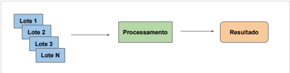
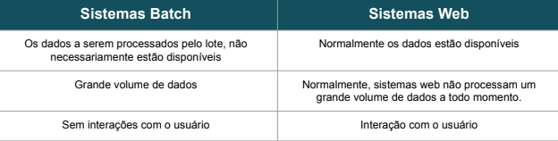
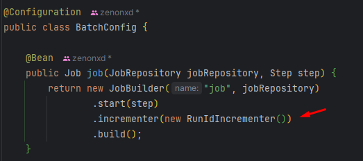
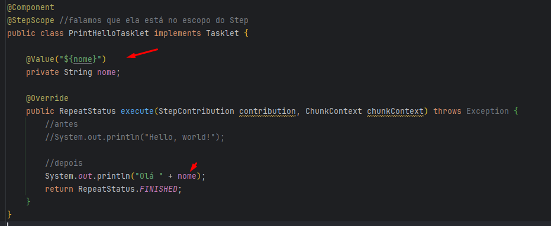
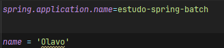
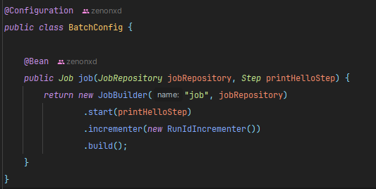
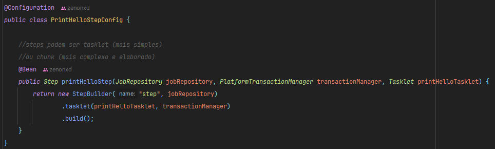
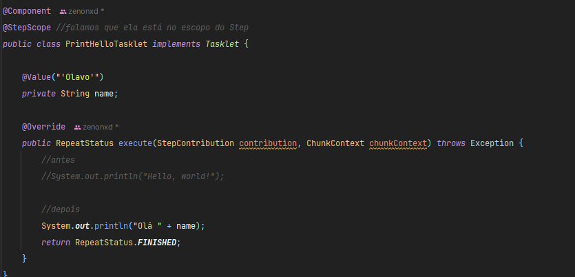

<p align="center">
  
</p>


# Objetivo

Aprenderemos a ideia dos sistemas em batch, problemas que eles querem resolver e quando podemos usar um sistema baseado 
em batch.

- O que são/quando usar e por que sistemas batch
- Características dos sistemas baseados em batch
- Introdução ao Spring Batch

# Introdução

Spring batch é um framework do Spring que permite o processamento em batch (lote).

Ele é especialmente útil para tarefas de processamento em lote (batch), como migração de dados, processamento de 
arquivos, importação e exportação de grandes conjuntos de dados, e geração de relatórios.

**Benefícios:**

Escalabilidade: Pode ser configurado para lidar com grandes volumes de dados, com suporte para paralelismo.

Controle de Erros e Logs: Possui controle de erros robusto e recomeço de tarefas interrompidas (retry).

Facilidade de Configuração: Pode ser configurado para diferentes fontes e destinos de dados, como bancos de dados, arquivos, 
etc. Ideal para tarefas automatizadas e repetitivas que lidam com muitos dados em sistemas corporativos.

# Sistema Batch

Batch = lote.

É um sistema para problemas específicos, onde precisamos quebrar um alto volume de dados em lotes para serem processados
de maneira incremental.

Esse tipo de sistema roda sem a interferência do usuário, são sistemas que agendamos a execução deles e eles executam alguma tarefa.



-representação de um sistema baseado em batch-

Processamento na imagem acima seria, por exemplo, uma limpeza de dados/trocar o formato do dado.

Já o resultado pode ser gerar um relatório, ou simplesmente persistir esses dados em um banco de dados ou até geração de log.

RESUMO: Chega um amontoado de dados, são quebrados em lotes, processados e temos o resultado.

## Exemplos de sistemas baseados em batch

1. Sistemas que trabalham de forma automática para enviar e-mails ou notificações

Vamos pensar numa operadora de telefone celular fazendo um envio de SMS em massa.

Teremos a leitura desses clientes no banco de dados, onde serão organizados em lotes (conjunto grande de dados/clientes).

Serão processados (verificar regra de negócio). Imagine que a promoção atenda um cliente com um nível de fidelidade 
específica? O processamento faria isso.

E depois teríamos o resultado, ele seria a ação em sí! O envio da mensagem para verificar se o cliente quer participar ou não.

2. Processamento de folha de pagamento

Um processamento de folha de pagamento, pode executar no 5 dia util do mês. Portanto, podemos agendar esse serviço 
(será baseado em batch).

Ele varrerá toda a base de dados dos funcionários e fará o processamento da folha de pagamento e então imprimí-lá 
(enviar por email, por exemplo).

## Definição Sistema Batch

É um sistema que realiza um processamento de uma quantidade finita de dados sem interação com usuário 
(diferente do sistema web) ou interrupção.

Além disso, o sistema batch precisam ter mecanismos para que se esse serviço (job) seja interrompido, ele volte a 
funcionar de onde parou.

## Por que usar processamento em Batch?

O processamento em batch (lote) é uma das formas mais eficientes para processar grandes volumes de dados.

## Sistema Batch x Sistema Web



### Por que os dados a serem processados não estão disponíveis em batch?

Imagine um sistema de cartão de crédito. Um usuário tem uma data onde a fatura fecha, não existe uma maneira de enviar 
essa fatura sem antes o fechamento da mesma, visto que o usuário pode ainda fazer outras compras em seu cartão, 
então não temos todos os dados necessários.

Portanto, esse sistema será executado em um momento específico.

## Quando utilizar Sistemas Batch

Seria ideal em:

1. Extração, transformação e carregamento (ETL)

Imagine um sistema que periodicamente gere um conjunto de arquivo. Esses arquivos são carregados e transformados por outro sistema.

2. Migração de dados

Migração de dado de sistema legado, por exemplo, para um novo banco de dados com o sistema compatível.

Essa migração é feita por batchs (lotes).

3. Processamento paralelo

Com o processamento paralelo conseguimos acessar vários batchs (lotes) ao mesmo tempo, de maneira concorrente e simultânea.

4. Tarefas que envolvem o processamento contínuo

Execução de um sistema 24/7. Em tese esse sistema recebe um fluxo contínuo de dados e, ao mesmo tempo, precisa processar
esses dados e fazer alguma ação (registrar no banco de dados, gerar algum relatório/parecer).

## O framework Spring Batch em sí

Inicialmente o Cobol foi a primeira linguagem a tornar-se famosa pelo processamento em Batch.

Além disso, o Spring Batch permite o processamento em lote para JVM utilizando o Spring.

## O que pensar ao trabalhar com grande volume de dados?

1. Tempo

Quanto tempo o processamento deve ser executado sem prejuízo de sistemas que dependem do processamento desse sistema?

2. Integridade

Se esse processamento falhar, como garantir a integridade desses dados? Se der algum erro, a execução precisa voltar de onde parou.

3. Execução

Será uma execução agendada? Precisa de uma interação humana para ativar?

Em geral, não teremos interação humana.

4. Monitoramento

Como acompanhar a operação do processamento?

Por sorte, o Spring Batch implementa vários desses pontos acima.

## Outras considerações ao trabalhar com Sistema Batch

1. Escalabilidade

Garante que o processamento dos dados sejam feitas dentro de uma janela de tempo, definida pela execução.

2. Disponibilidade

Se determinado dado não estiver disponível naquele momento, precisamos pensar em formas de manter o sistema funcionando.

3. Usabilidade

Sistemas em batch, assumem que não teremos uma interação humana. Precisamos pensar no job em sí, a forma que o código foi estruturado para ele executar essa tarefa.

Quantos passos ele vai executar? O que cada passo vai fazer?

# Resumo parte prática

1. Lembrar dos [tipos de sistema que usam batch](#exemplos-de-sistemas-baseados-em-batch)
2. A ideia é que se o sistema caia, volte de onde parou;
3. Os dados são processados em lotes;
4. Há um grande volume de dados;
5. É executado sem a interferência humana;
6. É muito usado para migração e integração de dados;
7. Diferente do sistema web, os dados não necessariamente estão disponíveis, [veja o motivo](#por-que-os-dados-a-serem-processados-não-estão-disponíveis-em-batch)
8. Lembrar de [quando usar Sistema Batch](#quando-utilizar-sistemas-batch)
9. [O que pensar ao trabalhar com o alto volume de dados? (tempo, integridade, execução, monitoramento)](#o-que-pensar-ao-trabalhar-com-grande-volume-de-dados)
10. [Lembrar de escalabilidade, disponibilidade e usabilidade](#outras-considerações-ao-trabalhar-com-sistema-batch)

# Parte prática

# Projeto 1 - Hello World

Criar um projeto com as dependências de spring batch e h2 database.

Criaremos uma classe BatchConfig dentro do pacote config.

Iremos criar um Job e um Step.

## Job

Representa um processo batch completo, composto por várias etapas (Steps).

## Step

Cada Step é uma fase do Job, onde uma tarefa específica é executada (ex.: leitura, processamento e escrita de dados).

## BatchConfig (Modelo básico)

❗Essa classe depois desse exemplo irá mudar, iremos realocar cada método (job, step e tasklet) para pacotes separados,
[veja aqui](#refatoração-do-hello-world-).

### Job

Recebe um jobRepository e um step.

Dentro do return new JobBuilder:

O primeiro argumento é nome do job, o segundo passamos o jobRepository. 

O jobRepository é responsável por manter os metadados. Metadados permite que o Framework controle o fluxo de execução.

Damos o start no step e o build.

```java
@Configuration
public class BatchConfig {

    @Bean
    public Job job(JobRepository jobRepository, Step step) {
        return new JobBuilder("job", jobRepository)
                .start(step)
                .build();
    }
}
```

### Step

Steps podem ser **tasklet** (mais simples) ou **chunk** (mais complexo e elaborado).

```java
@Configuration
public class BatchConfig {

    //metodo do job acima
    
    @Bean
    public Step step(JobRepository jobRepository, PlatformTransactionManager transactionManager) {
        return new StepBuilder("step", jobRepository)
                .tasklet((StepContribution contribution, ChunkContext chunkContext) -> {
                    System.out.println("Hello, world!");
                    return RepeatStatus.FINISHED;
                }, transactionManager // gerenciador de transações (neste caso, do H2)
                ).build();
    }
}
```

## Refatoração do Hello World 

Incluiremos um novo parâmetro no JobBuilder. Até o momento não tivemos nenhum problema pois estamos usando um banco H2
(memória), mas se fosse um MySQL, a medida que fossemos executando esse Job teríamos que ir alterando os parâmetros de 
execução dele.

Primeira coisa: runIdIncrementer.

Usaremos o ``.incrementer(new RunIdIncrementer())``. Basicamente, a todo Job (a cada execução), ele irá incrementar
o valor desse RunIdIncrementer.



### Step, Job e Tasklet em classes e pacotes diferentes

Não é ideal também manter o Job, Step e Tasklet na mesma classe, afinal um projeto pode ter vários jobs, steps e tasks.

Criar pacote para: step, job, tasklet.

#### Tasklet

Iremos retirar a tasklet também e alocá-lá em uma classe separada no pacote tasklets.

Criar pacote tasklet e criar a classe PrintHelloTasklet (ela será injetada no Step).

```java
@Component
@StepScope //falamos que ela está no escopo do Step
public class PrintHelloTasklet implements Tasklet {

    @Override
    public RepeatStatus execute(StepContribution contribution, ChunkContext chunkContext) throws Exception {
        System.out.println("Hello, world!");
        return RepeatStatus.FINISHED;
    }
}
```

#### Step

Criar classe PrintHelloStepConfig no pacote step.

Veja que a tasklet não está mais com a lambda dentro dela.

**Antes**

```java
@Bean
public Step step(JobRepository jobRepository, PlatformTransactionManager transactionManager) {
    return new StepBuilder("step", jobRepository)
            .tasklet((StepContribution contribution, ChunkContext chunkContext) -> {
                System.out.println("Hello, world!");
                return RepeatStatus.FINISHED;
                }, transactionManager // gerenciador de transações (neste caso, do H2)
            ).build();
}
```

**Depois**

Como realocamos a tasklet para uma classe a parte, ela também precisa ser injetada dentro do parâmetro do Step.

Passamos dentro dela a tasklet com injeção de dependência e o transaction manager.

```java
@Configuration
public class PrintHelloStepConfig {

    //steps podem ser tasklet (mais simples)
    //ou chunk (mais complexo e elaborado)
    @Bean
    public Step printHelloStep(JobRepository jobRepository, PlatformTransactionManager transactionManager, Tasklet printHelloTasklet) {
        return new StepBuilder("step", jobRepository)
                .tasklet(printHelloTasklet, transactionManager)
                .build();
    }
}
```

#### Job

Ficará dentro do pacote job na classe BatchConfig.

Só mudamos o nome do step para printHelloStep.

```java
@Configuration
public class BatchConfig {

    @Bean
    public Job job(JobRepository jobRepository, Step printHelloStep) {
        return new JobBuilder("job", jobRepository)
                .start(printHelloStep)
                .incrementer(new RunIdIncrementer())
                .build();
    }
}
```

## Usando variáveis no Spring Batch



Para rodar isso vamos em configuration e colocar uma enviroment "nome" com o seu valor ou colocar ela manualmente em
application.properties:



# Resumo parte prática

Precisamos ter pacotes e classes separados para Job, Step e Tasklet.

Vamos abordar essas classes agora explicando-as.

## BatchConfig (Job)

Será encarregada de criar e configurar um Job no SpringBatch.



### Parâmetros do método

JobRepository: Irá gerenciar a persistência e o status do Job e de seus Steps. 

❗ Ele é responsável por amarzenar o estado do Job no banco de dados, permitindo retornar de onde parou em caso de falha.

Step printHelloStep: Step é uma unidade de trabalho que fica dentro de um Job.

Cada Step pode conter uma lógica de negócio. O Job irá executar os Steps na ordem que forem definidos.

### JobBuilder

Esse ``new JobBuilder`` cria uma instância de JobBuilder, ficará responsável por **configurar o Job**.

O primeiro parâmetro é o nome do Job.

jobRepository: passa o JobRepository necessário para o Spring Batch gerenciar o estado do Job e seus Steps.

### .start(printHelloStep)

Define o ``printHelloStep`` como primeiro (ou único) Step a ser executado por este Job. Provavelmente, esse Step
conterá um Tasklet (responsável por executar uma unidade de trabalho específica).

### .incrementer(new RunIdIncrementer())

``RunIdIncrementer`` é um incrementador de identificador de execução do Job. No Batch, cada execução de um Job pode ter
um ID único. Esse ``RunIdIncrementer``, ajuda a garantir que cada execução tenha seu próprio ID (que será incremental).

Isso é útil para reexecutar um Job sem que o Spring Batch ache que ele já foi concluído e, portanto, o ignore.

### .build()

Finaliza a configuração do Job e o converte em uma instância de Job que será gerenciada pelo Spring.

### Exemplo de como o código funciona

Quando o Spring Batch inicia, ele utiliza essa configuração para definir um Job chamado "job":

1. O Job começa executando o Step printHelloStep.
2. printHelloStep executa a lógica especificada em um Tasklet (ou processo de chunk, se configurado dessa forma).
3. Após a execução do Step, o Job termina.
4. Cada execução do Job recebe um ID exclusivo, permitindo reexecutar o Job sem conflitos de identificadores.
Resumo
5. Esse código define um Job básico com um único Step e um incrementador de ID. O BatchConfig cria o Job como um bean, 
permitindo que ele seja gerenciado automaticamente pelo framework Spring Batch e que seja configurado de maneira modular.

## StepConfig



### Parâmetros do Método

JobRepository: o repositório de Jobs é necessário para armazenar e gerenciar o estado de execução do Step e do Job
ao qual ele pertence.

PlatformTransactionManager: é um gerenciador de transações. É necessário para que o Spring Batch gerencie-as durante
a execução do Step. ❗**Vai garantir consistência de dados em caso de falhas**!

Tasklet printHelloTasklet: É o tasklet executado pelo Step. Contém uma lógica específica que o Step realizará.

Como é um Tasklet, essa lógica é simples e executada uma única vez. Se fosse chunks, seria um processamento mais longo.

### StepBuilder

new StepBuilder("step", jobRepository): cria um Step chamado "step" usando o stepBuilder que ajudará a configurar os
detalhes do Step.

jobRepository: este repositório de jobs é passado para o StepBuilder para permitir que o Spring Batch gerencie e 
persista o estado de execução deste Step.

### .tasklet(printHelloTasklet, transactionManager)

Define o tasklet que será executado pelo Step. Neste caso, o printHelloTasklet é a lógica que será utilizada.

transactionManager: é o gerenciador de transações. Usado para garantir que a execução do tasklet seja **TRANSACIONAL**,
❗permitindo que seja revertido em caso de falha.

### .build()

Este método finaliza a configuração e cria uma instância de Step. Esse Step é então exposto como um bean no contexto Spring.

### Exemplo do Funcionamento

Ao configurar um Job (BatchConfig), esse step poderá ser adicionado ao Job para ele execute o Tasklet (printHelloTasklet).

1. Quando o Job inicia, ele chama o Step printHelloStep.
2. O Step executa o Tasklet printHelloTasklet, que realiza uma tarefa específica, como imprimir uma mensagem.
3. O PlatformTransactionManager garante que a execução do Tasklet seja transacional. Se houver uma falha, as operações realizadas pelo Tasklet poderão ser revertidas.
4. Após a execução do Tasklet, o Step termina, e o Job continua para o próximo Step (se houver).

### Resumo

Esse código configura um Step simples (printHelloStep) com um Tasklet (printHelloTasklet). Esse Step é transacional e 
controlado pelo PlatformTransactionManager. A configuração é ideal para tarefas pequenas e autônomas que podem ser 
concluídas em uma única execução e para Jobs que necessitam de Steps com baixa complexidade.


## Tasklet



1. Injeção de Dependência com @Value:

Anotação @Value("${name}") instrui o Spring a injetar o valor da propriedade name definida no arquivo 
application.properties (ou application.yml).

Para isso funcionar, você precisa definir a propriedade name no seu arquivo de propriedades, assim:

```properties
name=João
```

2. Método execute:

Este método faz parte de um Tasklet do Spring Batch. Um Tasklet é uma interface do Spring Batch que define uma operação
única ou um "passo" em um job batch.

A linha System.out.println("Olá " + name); imprimirá "Olá " + seguido do valor de name (neste exemplo, "João").

3. Valor de Retorno:

O método execute retorna RepeatStatus.FINISHED, indicando que o Tasklet completou a sua tarefa e não precisa ser 
repetido.

Estes códigos são códigos mais básicos e introdutórios. A seguir, entraremos em um projeto onde iremos fazer uma
requisição em uma API remota, buscar esses dados, processá-los e gravá-los em um banco de dados (MysQL).